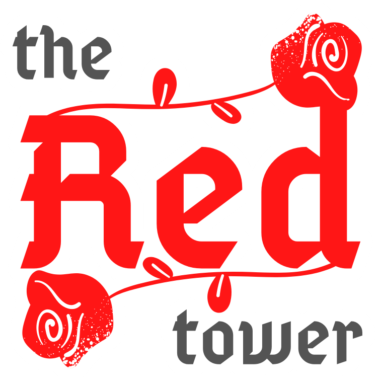

[PLAY 🌹](https://igoralopes.github.io/Projeto01-GAME-Ironhack/)

[Slides Presentation](https://docs.google.com/presentation/d/1oENtEqeZMUiKpOOIpdCtNAK-1kv4ILmziORKGszgEv4/edit?usp=sharing)

#PORTUGUÊS

Primeiro projeto referente ao curso de Web Development da Ironhack. Turma de ago/2022 Fulltime - Remote - São Paulo

O trabalho constitui-se na criação de qualquer jogo utilizando as linguagens HTML, CSS e JavaScript.

O game aqui desenvolvido, consiste em uma dinâmica por turnos, onde o jogador realiza uma ação e o inimigo(computador) realiza outra logo em seguida. A batalha com temática medieval e fantasia, termina quando o jogador derrota todos os inimigos (atualmente 1) ou morre em decorrência da perda de todos os seus pontos de vida.

Sinopse:
Em um reino desolado por criaturas maléficas, o rei, em um ato de desespero, envia seu melhor e último cavaleiro remanescente em uma missão para descrobrir a fonte dos avassaladores ataques ao seu território.

#ENGLISH

First project related to Ironhack's Web Development course. Class of Aug/2022 - Fulltime - Remote.

The work consists in the creation of any game using HTML, CSS and JavaScript languages.

The game developed here is based on turns dynamic, where the player performs an action and the enemy (computer) performs another immediately afterwards. The medieval and fantasy-themed battle ends when the player defeats all enemies (currently 1) or dies as a result of losing all his life points.

Synopsis:
In a kingdom desolated by evil creatures, the king, in an act of desperation, sends his best and last remaining knight on a quest to discover the source of the overwhelming attacks on his territory.